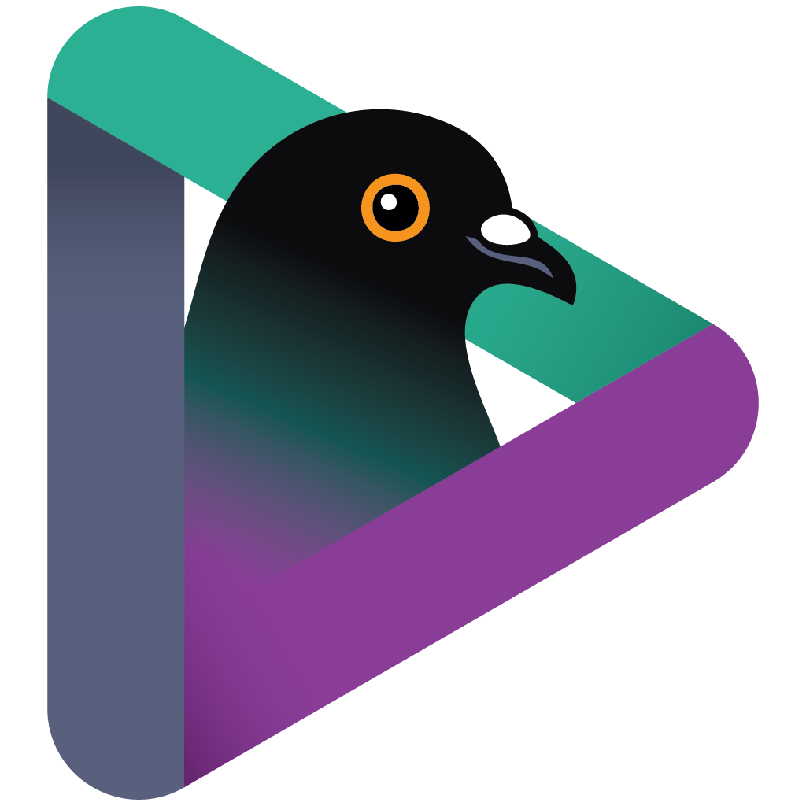

<p align="center">
  
</p>

# AresToys

> Modern productivity suite for Windows — unifies CopyQ (clipboard), ShareX (capture + upload), and MaxLauncher (keyboard launcher) into one app, plus tools none of them ship.

**Status:** Alpha, actively shipped. Latest release: **v0.1.15** (2026-05-16); v0.1.16 in flight. Velopack-driven installer + portable + delta updates flow through GitHub Releases on every tagged version.

---

## What AresToys is

AresToys is a Windows desktop application that brings together three of the most-used productivity tools — [CopyQ](https://github.com/hluk/CopyQ) (clipboard manager), [ShareX](https://github.com/ShareX/ShareX) (screenshot + uploader), and [MaxLauncher](https://maxlauncher.sourceforge.io/) (keyboard-centric app launcher) — under a single modern UI built on .NET 10 and WPF.

The core idea: **everything you copy or capture is part of the same searchable history**. A clipboard text entry, a screenshot, and a freshly-generated share link all live as items in one timeline — same store, same search, same browser.

On top of feature parity with the upstreams, AresToys adds tools none of them ship:

- **Wormholes** (Stardock Fences / Portals-style desktop folders) — floating, draggable, lockable windows that live-mirror a real filesystem folder. Right-click any folder in Explorer → "Create Wormhole" turns it into a desktop grid that stays in sync via FileSystemWatcher; Ctrl+Wheel zooms tile size per-wormhole; collapse to header-only, hide, lock independently, or in batch via hotkey-bound workflow tasks (Hide all / Show all / Lock all / Toggle / Create…). Native Windows shell context menu on every item (dark-themed on Windows 10 1903+) means every third-party verb the user has installed — 7-Zip, Send to, Open with…, Properties — works out of the box, no curated allow-list to maintain.
- **AI background removal** ("Magic eraser") — local U2NetP saliency model via ONNX Runtime with DirectML acceleration, brush-based touch-up (Add / Remove with hardness control), feather + edge offset post-processing. No upload, no API key, runs offline on any DX12 GPU.
- **Raster-to-SVG tracer** — Illustrator-style trace panel with 12 stock presets, live WebView2 SVG preview, full parameter dock (paths / corners / noise / smoothing / pre-blur / overlap radius), and a manual palette picker that lets you sample colours directly from the source image with the on-screen eyedropper — related tones (e.g. white + light grey) collapse into the nearest pick instead of getting an arbitrary auto-quantized palette.
- **QR codes** — generator with live preview, multiline editor, error-correction picker, PNG / SVG export; decoder via region select; right-click any clipboard text item to pre-fill the generator. Each generated QR enters the unified history like any other capture.
- **`.sxie` + `.sxcu` round-trip** — full ShareX preset compatibility, both ways. 60+ ported image effects and the custom-uploader engine read and write ShareX's exact JSON schema, so presets move between the two apps without translation.
- **Pipeline / workflow editor** — every capture, clipboard, and upload action is a composable chain of pipeline tasks (capture → effect preset → upload → notify → copy URL → …) the user edits, reorders, or disables in Settings. Hotkey-driven and pluggable.

## What it aims to fix

- **CopyQ has a powerful clipboard engine but a UI that feels stuck in the early 2000s.** AresToys keeps the engine, replaces the UI with a clean Fluent-style WPF design.
- **ShareX has every feature imaginable, and that's the problem.** Hundreds of uploaders, dozens of effects, a dense forest of options. AresToys keeps the proven backend (capture, recorder, image editor logic, upload pipeline) and trims the UI to the essentials, with everything else moved behind an opt-in plugin system.
- **The ShareX image editor has known UX pain points** (tool color leaking into already-drawn objects, awkward color picker, cramped toolbar). AresToys rebuilds the editor with a clear separation between "next-object color" (global swatches) and "selected-object color" (per-object property panel), a proper color picker with palette/recents/eyedropper, and a logically grouped toolbar.
- **Windows' native clipboard history is too shallow, ShareX's is screenshot-only, CopyQ's is clipboard-only.** AresToys unifies them into a single browsable timeline.

## What works today

The app boots, hosts a tray icon, registers global hotkeys, and the following flows are complete end-to-end:

**Capture**
- Region capture (Win+Shift+S) with darkened overlay, window snap, **multi-region drag-to-accumulate** (Enter applies the composite — bbox of all rects with everything outside any rect transparent), **snap-to-windows preview** while idle, marching-ants screen-edge crosshair, per-rect 8 grip handles, draggable popup toolbar with status + zoom + Apply / Cancel
- Fullscreen / per-monitor / last-region / active-window capture (DWM extended bounds — no resize-border padding) via the tray menu
- Full-page **webpage capture** of any URL via WebView2 (affordances auto-hide on machines without the runtime; tray surfaces an "install runtime" entry)
- Screen recording → `.mp4` (Shift+PrtScn) and `.gif` (Ctrl+Shift+PrtScn) via FFmpeg
- Screen color picker / sampler (hex / RGB / HSB / CMYK / decimal / linear / BGRA copy formats) — round magnifier with wheel zoom (3–41 px sample window) and pixel-coordinate readout, shared with the editor crop tool and the eyedropper
- Pin-to-screen (always-on-top thumbnail with drag + wheel zoom)
- Per-workflow `Auto-confirm on first selection` option to skip the multi-region toolbar for "rapid screenshot" flows

**Clipboard**
- Persistent SQLite history with FTS5 search + DPAPI-encrypted payloads
- CopyQ-style popup (Win+V) with custom categories, pin, search header, filter dropdown, vertical toolbar, geometry persistence, Ctrl+1-9 quick-paste
- **Per-item labels** (CopyQ "Notes" equivalent): replace the auto-derived snippet in the row title with a user-typed name. Three input gestures — right-click → Rename label, F2 inline rename, always-on TextBox above the preview pane. FTS5 search matches across content AND label
- **Drag-to-category-tab** as a shortcut for the right-click Move-to menu — a custom drag payload keeps the gesture distinct from Explorer / text drags
- **User-controlled pinned reorder**: drag a pinned row onto another (insert-before), or use on-hover chevron up / down buttons to swap with the adjacent neighbour. New pins land at the bottom of the strip
- Process blacklist (KeePass / 1Password / etc.) + incognito-mode hotkey
- Auto-rotation: keep last N items / last N days, per-category overrides

**Editor**
- WPF-based, ShareX-inspired — Rectangle, Ellipse, **Line / Arrow** (unified primitive with per-end caps and pickable tip style: ShareX-style curve or filled triangle), Freehand (smooth + per-end caps), Text (drag-to-draw + wrap), **Step counter** (draggable tail handle, right-click delete-and-renumber), Image, Pixelate, Blur, Spotlight, Smart Eraser, **Crop with multi-area support** (every drag appends a pending rect, Apply All bakes them as a composite)
- Outer-aligned outlines (EvenOdd ring geometry)
- Color picker with palette + recents + live preview + eyedropper (full-screen `ScreenColorPickerOverlay` with round magnifier shared across every sampler surface)
- Clipboard round-trip (Ctrl+C/X/V) preserves shapes as editable objects in-process, falls back to raster for other apps
- **Effects launcher** opens the image-effects panel directly from the editor and swaps the rendered result back as an undoable canvas op
- **Magic eraser** (AI background removal) and **Trace** (raster → SVG) launch from the same toolbar; both produce a result that re-enters the editor as an undoable swap
- **Alt+click "modifica al volo"** on placement tools auto-switches to Select for one edit and bounces back to the previous tool on deselect. Esc is layered (first tap clears selection + cancels the bounce; second tap closes the editor)
- **Multi-editor** — open multiple editor windows in parallel without focus stealing
- Save commits to history in the global capture format; **Save as…** exports to a path + format the user picks (PNG / JPEG / BMP / GIF)
- Toolbar icons, panel titles and side-panel actions follow the active accent theme (no more hard-coded white)

**Image effects**
- 60+ effects ported from ShareX across Adjustments (brightness / contrast / saturation / hue / levels / curves / temperature / split-toning / film emulation / …), Manipulations (canvas / crop / resize / rotate / shadow / rounded-corners / auto-crop / skew / flip / orthogonal-rotate), Filters (blur / motion-blur / sharpen / glow / pixelate / vignette / colour halftone / torn-edge / emboss / edge-detect / add-noise), Drawings (background / border / text / text-ex / image / particles / checkerboard / gradient overlay)
- Editor with multi-preset list, drag-reorderable effect chain, live preview on a sample image (or a user-loaded one), property grid with sliders / colour swatches / paddings / gradients / fonts
- Gradient picker (multi-stop with per-stop alpha + 9 ShareX presets) and a font picker (filterable family list + size slider + bold/italic chips)
- ShareX-compatible `.sxie` import + export — preserves the exact PascalCase + `$type` schema so a preset round-trips between ShareX and AresToys. Exports bundle asset files (DrawImage overlays) into the `.sxie` ZIP automatically
- File-association toggle for `.sxie` (mirrors the `.sxcu` flow): double-click a downloaded preset in Explorer → opens the editor with the preset already imported
- Pipeline task `Apply effects preset` lets the user attach any preset to capture / clipboard workflows so every screenshot can be auto-watermarked / coloured / cornered

**QR codes**
- Generator with live preview window (multiline editor → real-time QR), error-correction picker (L/M/Q/H), module-size slider, copy-to-clipboard, save as PNG, save as SVG, save into clipboard history (treated like a screenshot — file in the screenshot folder + history entry + optional upload)
- Decoder via region select (Tools → "Read QR code" or as a pipeline task)
- Right-click on a clipboard text item → "Generate QR code…" pre-fills the generator with that text
- Pipeline tasks: Show QR code, Save QR as image, Save QR as SVG, Copy QR to clipboard — all chainable with the rest of the workflow system

**Notifications**
- Modern Windows toasts (`ToastNotificationManagerCompat`) — they persist in the Notification Center after the popup fades, with inline preview thumbnails for image-bearing toasts (screenshot saves, QR saves) and unique tag/group per toast so successive notifications don't replace or collapse each other

**Uploaders** (10 bundled)
| Uploader | Auth | Capability |
|---|---|---|
| Catbox | none | Any file |
| Uguu.se | none | Any file (~3h expiry) |
| paste.rs | none | Text |
| Imgur (anonymous) | bundled Client ID | Image |
| ImgBB | user API key | Image |
| Pastebin | user API key | Text |
| GitHub Gist | user PAT | Text |
| OneDrive | OAuth (Azure AD v2) | Any file |
| Google Drive | OAuth | Any file |
| Dropbox | OAuth | Any file |

Plus a declarative `.sxcu` engine that loads ShareX-compatible JSON uploader files dropped into `%LOCALAPPDATA%\AresToys\custom-uploaders\` for the long tail. Optional file-association toggle in Settings registers AresToys as the default opener for `.sxcu` files in Explorer (per-user, no admin), so double-clicking a `.sxcu` from a website triggers an import-confirmation dialog.

**Pipeline & workflows**
- All capture / clipboard / upload flows run as composable pipelines (named "workflows"). Steps are user-editable in Settings → Hotkeys & workflows: add / remove / reorder / disable.
- Hotkey rebinder via low-level keyboard hook (handles Win+V, Win+Shift+S etc. that `RegisterHotKey` can't bind).
- Built-in profiles: region capture, screen recording, color picker/sampler, pin to screen, manual upload, upload clipboard text, open clipboard, open launcher.

**Wormholes**
- Per-wormhole record persisted as JSON at `%LOCALAPPDATA%\AresToys\wormholes.json` (atomic-rename writes via `FileStream.Replace`). Position, size, lock state, hidden state, rolled state, icon-size override, opacity override, tile padding override all round-trip without losing geometry across restarts.
- Appearance knobs in Settings → Wormhole settings: icon size, tile padding, label font size (8–20 px), label lines (1–3), line spacing (CSS-style negative-margin overlap between rows, -32…+32), background opacity, border opacity (fades the 1 px accent ring + drop shadow independently from the body). All persist app-wide; per-wormhole overrides exist in the data model for future per-record UI.
- F2 on a selected tile opens an inline rename overlay (Explorer-style: basename pre-selected, extension untouched, `File.Move` commits, `Esc` cancels). Single-wormhole item selection (clicking an item in wormhole A clears the highlight in B, like Explorer's per-folder model). ↑/↓ reorder buttons in the Settings list; clicking a wormhole on the desktop highlights its row in the settings panel.
- All-sides resize (WM_NCHITTEST + custom grip regions), DragMove on the header, double-click rolls to header-only height (≈ 48 px), single-instance pipe IPC forwards the Explorer "Create Wormhole" verb to the running AresToys (cold-start via `--create-wormhole` CLI flag when applicable).
- Inline search: the magnifying-glass button in the header expands into a 250 ms-debounced TextBox that filters the visible icons against `DisplayName`. Esc clears + collapses; Enter commits + drops focus while keeping the textbox visible.
- Workflow tasks: `Hide all wormholes`, `Show all`, `Lock / Unlock all`, `Collapse / Uncollapse all`, smart toggle variants, `Create wormhole`. Bound to user hotkeys via the existing pipeline-trigger machinery.

**Other**
- Categories (CopyQ-style) with Move / Copy / Delete and per-category clear
- Settings backup / restore (JSON export / import) — v3 format carries per-item clipboard labels; v2 backups (including the legacy `shareq-settings-*.json` snapshots) keep importing unchanged
- Themes with WPF-UI v4 brush overrides + custom Surface1/2/3 + Foreground / AccentForeground
- Launcher overlay (MaxLauncher-inspired): F1-F10 strip + 10 numeric tabs × 30 QWERTY cells, drag-and-drop assignment, search-as-you-type
- **Full Italian localization** (UI, settings, editor, image effects, pipeline-action catalog, dialogs) with a Language picker in Settings
- Autostart toggle + Start-minimized option (both HKCU, no admin)
- Update-available prompt routes through the modern Windows toast pipeline, so it persists in the Action Center alongside every other capture / clipboard / recording event

## What's still missing

Headline gaps against the upstream feature set:

- **No SharedFolder / FTP / SFTP / S3 / Azure / B2 uploaders** — backlog (FTP + SharedFolder are next; cloud-storage providers come after).
- **No scrolling capture / image combiner / hash checker / metadata viewer** — backlog. (Explorer context menu shipped; OCR was tried via Windows.Media.Ocr and dropped — too unreliable on dark themes / low contrast for the maintenance cost.)
- **Bundled OAuth client IDs aren't shipped** in the public source. Maintainers create `src/AresToys.Uploaders/Secrets.Local.cs` with their own credentials (gitignored). End users of a public release get zero-friction sign-in; users building from source themselves will see "isn't configured in this build" until they either drop in their own keys or paste credentials in the Configure dialog.
- **No CLI / scripting interface** — everything runs through hotkeys + workflows.

## Future ideas

Tracked but not on a release timeline — small / niche / scoped-out polish that would land if the headline backlog frees up, or if user feedback bumps any of them in priority. Open an issue if one of these blocks your workflow.

- **Clipboard tags** ([#4](https://github.com/Ares9323/AresToys/issues/4)) — orthogonal many-to-many filtering dimension on top of the existing Categories (one item = one category) and Labels (custom title). Schema migration with a `item_tags(item_id, tag_name)` join table, FTS index extension, per-row tag chips, autocomplete context-menu, AND/OR filter strip in the Clipboard window. Likely pinned-items-only to keep the footprint reasonable.
- **Per-wormhole opacity slider** in the wormhole chrome hamburger menu — today opacity is configurable in Settings → Wormholes as an app-wide default + a per-record override exists in the data model but has no UI surface. Hamburger menu would expose an inline 30 – 100 % slider that writes straight to the record so the user can dial each wormhole independently without reaching the Settings panel.
- **Per-wormhole accent / theme override** — let each wormhole carry its own accent colour so a user can colour-code wormholes by project (red for git scratch, blue for design refs, green for daily notes…). Hamburger menu entry → opens the same `ColorPickerWindow` the Theme tab uses; new field on `WormholeRecord` that overrides `AccentBackgroundBrush` for that window's chrome only, fallback to the global theme when null.

## Tech stack

- .NET 10, C# (Windows-only)
- WPF + [WPF-UI](https://github.com/lepoco/wpfui) for Fluent/Mica styling
- [CommunityToolkit.Mvvm](https://github.com/CommunityToolkit/dotnet) for MVVM
- [Microsoft.Data.Sqlite](https://learn.microsoft.com/dotnet/standard/data/sqlite/) with WAL + FTS5 + DPAPI-encrypted payloads
- DXGI Desktop Duplication + `Windows.Graphics.Capture` for screen capture
- FFmpeg (auto-downloaded on first use) for screen recording
- [SkiaSharp](https://github.com/mono/SkiaSharp) for the image-effects pipeline (ports of ShareX's per-pixel work to a managed surface)
- [QRCoder](https://github.com/codebude/QRCoder) for QR generation (PNG + SVG)
- [ZXing.Net](https://github.com/micjahn/ZXing.Net) for QR decoding
- [Microsoft.Toolkit.Uwp.Notifications](https://learn.microsoft.com/windows/apps/design/shell/tiles-and-notifications/send-local-toast?tabs=desktop) for Windows toast notifications (Action Center persistence + inline images)
- [Velopack](https://github.com/velopack/velopack) for installer / portable packaging and auto-update via GitHub Releases
- [ONNX Runtime](https://onnxruntime.ai/) with the DirectML execution provider — runs the embedded U2NetP saliency model behind the Magic eraser locally on any DX12 GPU (CPU fallback otherwise)
- Bundled [potrace](http://potrace.sourceforge.net/) 1.16 (BSD) under `Tools/` drives the raster → SVG tracer

## Roadmap

| Milestone | Scope | Status |
|-----------|-------|--------|
| **M0** | Solution scaffold, CI green, WPF app opens with tray | ✅ done |
| **M1** | Clipboard hook + storage + popup window with FTS search | ✅ done |
| **M2** | Hotkeys + region capture + base pipeline | ✅ done |
| **M3** | Image editor (port + UX fixes) | ✅ done |
| **M4** | Plugin loader + Imgur uploader + upload pipeline | ✅ done (replaced DLL plugin loader with bundled-class architecture + `.sxcu` for the long tail) |
| **M5** | OneDrive uploader + main window timeline + plugin manager UI | ✅ done (extended to OneDrive + GoogleDrive + Dropbox + 7 more) |
| **M6** | Screen recorder + Beautify + Watermark/Step counter | ✅ done — recorder ships; Watermark + step-counter live in the image-effects pass below; Beautify (the standalone one-click "make this look nicer" tool) shelved as low-impact |
| **M6.5** | Image-effects framework (60+ ShareX effects, `.sxie` round-trip, gradient + font pickers, live editor, pipeline task) | ✅ done |
| **M6.6** | QR generator UX (live preview window + multiline editor + PNG/SVG export + Action-Center notifications) | ✅ done |
| **M7** | Velopack packaging + GitHub auto-update + release v0.1.0 | ✅ done — v0.1.0 shipped 2026-05-05; latest is v0.1.8 (2026-05-13), v0.1.9 in flight |

After M7, the next themed passes (rough order):
1. SharedFolder + FTP/FTPS/SFTP uploaders
2. Cloud storage uploaders (S3 / Azure Blob / Backblaze B2 / Google Cloud / Cloudflare R2)
3. Scrolling capture
4. CLI for scripting

(Italian localization landed in 0.1.1 and is now part of every build — the placeholder has moved out of the post-M7 list.)

## Building

Requirements: .NET 10 SDK, Windows 10 / 11.

```powershell
git clone https://github.com/Ares9323/AresToys
cd AresToys
dotnet build
dotnet run --project src/AresToys.App
```

For the OAuth uploaders (OneDrive / Google Drive / Dropbox / Imgur user-mode) to work without per-user setup, register apps with each provider following [`docs/RegisterAppGuide.md`](docs/RegisterAppGuide.md), then create `src/AresToys.Uploaders/Secrets.Local.cs` (gitignored) with the constants documented inside `src/AresToys.Uploaders/Secrets.cs`. Without `Secrets.Local.cs` the OAuth uploaders surface "isn't configured in this build" — the rest of AresToys runs fine.

User data lives at `%LOCALAPPDATA%\AresToys\` (SQLite + custom-uploaders + recordings). Delete that folder to reset to defaults.

## Releases

Distribution is built with [Velopack](https://velopack.io): every release ships both an installer (`AresToys-win-Setup.exe`) and a portable zip (`AresToys-win-Portable.zip`). The in-app updater (Settings → About → "Check for updates") fetches delta packages from GitHub Releases — only the differences between versions are downloaded.

To cut a release (maintainer), pick one of three equivalent paths:

1. **One-shot from a local terminal** — bump `<Version>` in `src/AresToys.App/AresToys.App.csproj` (strip the `-dev` suffix for the tagged version), then run `pwsh tools/release.ps1` (or double-click [`release.bat`](release.bat) from Explorer). The script refuses to run on a dirty tree or if the tag already exists locally / on origin, runs `tools/test-local.ps1`, asks for confirmation, creates the annotated tag and pushes it. The pushed tag fires the on-tag trigger of `release.yml`, which builds + packs + publishes the GitHub Release. Flags: `-SkipTests`, `-SkipConfirm`, `-Version X.Y.Z` (override), `-Force` (allow dirty tree). If the push fails the local tag is removed automatically so the next run starts clean.
2. **Manual tag push** — `git tag v0.1.8 && git push origin v0.1.8` triggers the same on-tag pipeline. A SemVer pre-release suffix (`v0.1.8-rc1`) auto-marks the GitHub Release as pre-release; no extra flag needed.
3. **GitHub UI** — Actions tab → **Release** workflow → **Run workflow**, type the semantic version (e.g. `0.1.0`) and tick "prerelease" if applicable. Same vpk pack + GitHub Release pipeline as the other two paths.

The `vpk` CLI is pinned in [`.config/dotnet-tools.json`](.config/dotnet-tools.json) — `dotnet tool restore` installs the same version locally for testing the pack step before pushing a tag. The convenience wrapper [`tools/pack-local.ps1`](tools/pack-local.ps1) drives the same `dotnet publish` + `vpk pack` chain the workflow uses, with a few quality-of-life shortcuts:

```powershell
pwsh tools/pack-local.ps1                 # auto-pick the latest version in Releases\, overwrite
pwsh tools/pack-local.ps1 -Version 0.2.0  # explicit version (cleans prior artifacts for the channel)
pwsh tools/pack-local.ps1 -SkipBuild      # reuse the existing bin\Release output
pwsh tools/pack-local.ps1 -Channel local  # produce artifacts on a separate channel so the public 'win' channel stays clean
```

After pack, `Releases\AresToys-<channel>-Setup.exe` installs AresToys into `%LocalAppData%\AresToys` exactly as a real release would; `Releases\AresToys-<channel>-Portable.zip` extracts into a folder you can run from anywhere.

## Acknowledgements

AresToys stands directly on the shoulders of two GPL-3 projects, and reuses substantial portions of one of them:

- **[ShareX](https://github.com/ShareX/ShareX)** — the bulk of AresToys's backend (capture, image editor, screen recorder, image effects, uploaders) is being ported from ShareX's modular libraries. Original authors and maintainers retain credit; AresToys is a derivative work and is itself GPL-3-or-later.
- **[CopyQ](https://github.com/hluk/CopyQ)** — used as conceptual reference for the clipboard manager experience: history model, item-plugin architecture, popup-on-hotkey workflow.
- **[MaxLauncher](https://maxlauncher.sourceforge.io/)** — inspired AresToys's launcher overlay: the keyboard-centric grid of mappable cells (F1-F10 global strip + 10 numeric tabs × 30 QWERTY keys), drag-and-drop assignment of files / shortcuts / folders, and the search-as-you-type filter that hides non-matching tabs and cells.

The licensing of both upstream projects (GPL-3-or-later) carries through to AresToys. See [`LICENSE`](LICENSE).

## License

[GPL-3.0-or-later](LICENSE), inherited from both upstream projects.

## Contributing

The project is in early alpha and the API surface is still moving. Issues + bug reports are welcome; for code contributions please open an issue first to discuss scope before sending a PR.
